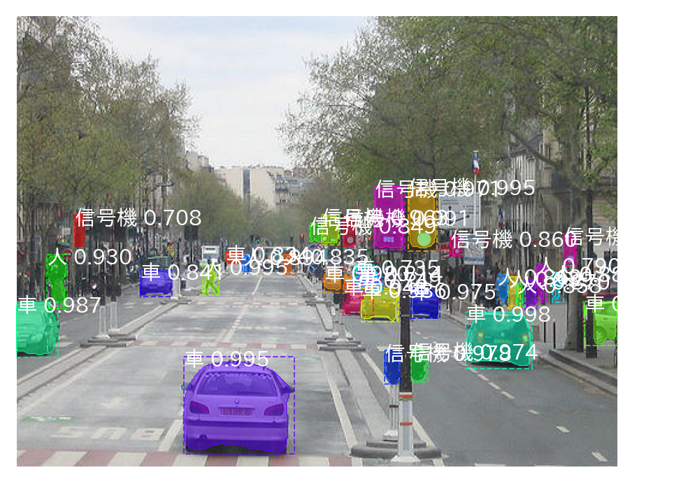

**This repository is forked from matterport/Mask_RCNN. Thanks!**

# Mask R-CNN for Object Detection and Segmentation

これは [Mask R-CNN](https://arxiv.org/abs/1703.06870) を実装したものです。
実装のオリジナルは [matterport/Mask_RCNN](https://github.com/matterport/Mask_RCNN) にあります。

* Google Colab 用 demo
  [demo_jp_colab.ipynb](samples/demo_jp_colab.ipynb)
  [](https://colab.research.google.com/github/ttnok/Mask_RCNN_forked/samples/demo_jp_colab.ipynb]
